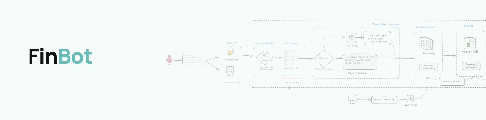

# FinBot: Financial Report Query Interface

**FinBot** is an interface for financial reports that allows users to upload PDF documents and ask queries about the financial data. The interface facilitates real-time queries and displays retrieved information alongside generated responses.

## Data Requirement

The data used to index the vector database comes from PDF files. These files are processed and indexed to create embeddings, which are then stored in a vector database (Chroma) for efficient similarity search.

## Implementation Workflow

The implementation is divided into multiple components that work together to process queries and retrieve relevant information.

## Setup

### Step 1: Clone the Repository

Clone the GitHub repository to your local machine:

```bash
git clone https://github.com/poorna1995/finbot.git
```

### Step 2: Create an .env File

Create a .env file in the root directory and add your API keys:

```bash
OPENAI_API_KEY=YOUR_OPENAI_KEY
UNSTRUCTURED_API_KEY=YOUR_UNSTRUCTURED_API_KEY
UNSTRUCTURED_API_URL=YOUR_UNSTRUCTURED_API_URL
```

### Step 3: Build Docker

Build the Docker image, which also handles vector database indexing:

```bash
docker build -t finbot .
```

### Step4 : Run Docker

```bash
docker run -p 8502:8502 finbot
```

### Step5 : streamlit host

```bash

URL: http://0.0.0.0:8502

```
