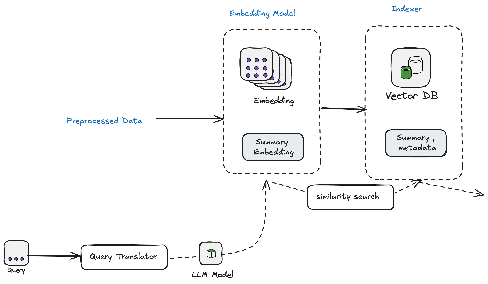

# FinBot: Financial Report Query Interface

**FinBot** is an interface for financial reports that allows users to upload PDF documents and ask queries about the financial data. The interface facilitates real-time queries and displays retrieved information alongside generated responses.

## Data Requirement

The data used to index the vector database comes from PDF files. These files are processed and indexed to create embeddings, which are then stored in a vector database (Chroma) for efficient similarity search.

## Implementation Workflow

The implementation is divided into multiple components that work together to process queries and retrieve relevant information.


## Document Parsing - Unstructured.io

It focuses on converting raw unstructured data (e.g., PDFs, Word documents, HTML files, emails) into structured, machine-readable formats such as JSON , HTML or text


## Data Preprocessing

### Preprocessing Structured Table Data:

1. **Load Table Data**: Extract the table data from a structured document.
2. **Generate Insights**:
   - **Summary**: Use a summarization model to create a concise summary of the data.
   - **Title**: Generate a suitable title based on the filtered data.
   - **Keywords**: Extract key terms from the data for easy reference.
3. **Append Metadata**: Combine the filtered table with the generated summary, title, and keywords into a structured output format.


## Indexer

This module is responsible for representing textual or other forms of data as vectors (numerical representations) and then indexing them into a vector database like **Chroma**.

The module takes a user query and makes a decision about what type of query the user has requested (e.g., Vector DB or Tool).

### Current Classifications:

1. **Infosys Financial PDF Documents**: Queries related to financial documents in PDF format.
2. **Upload PDF Document**: Queries requesting the upload of PDF documents.



## Query Translator

The **Query Translator** is responsible for transforming user queries into a format suitable for retrieval. There are two primary methods used:

### Method 1: Simple Query Enhancer

This method translates the user query into a format that matches the retrieval mechanism. It may involve basic enhancements or rephrasing to improve search accuracy.

### Method 2: Query Decomposition (Future Work)

For complex queries, this method splits them into simpler sub-queries that can be handled individually by the retrieval system. This enables the system to process more complex requests efficiently.


## Retriever

The **Retriever** component is responsible for fetching the most relevant information based on the user query. It works with two types of data sources:

### 3.1 Vector Database

The retriever queries the Vector Database (such as **Chroma**) to retrieve the top k most relevant documents based on the semantic similarity between the query and the indexed documents.


## Generator

The **Generator** component produces the final response based on the user query and the retrieved context. It combines the user’s query with the retrieved data (from the Vector DB) and generates an answer.

The **LLM** (Large Language Model) is used to generate a comprehensive response, taking into account the user’s input and any context retrieved from the Vector Database.


## Setup

### Step 1: Clone the Repository

Clone the GitHub repository to your local machine:

```bash
git clone https://github.com/poorna1995/finbot.git
```

### Step 2: Create an .env File

Create a .env file in the root directory and add your API keys:

```bash
OPENAI_API_KEY=YOUR_OPENAI_KEY
UNSTRUCTURED_API_KEY=YOUR_UNSTRUCTURED_API_KEY
UNSTRUCTURED_API_URL=YOUR_UNSTRUCTURED_API_URL
```

### Step 3: Create a Virtual Environment

```bash
Create: python -m venv <name>

activate : source <name>/bin/activate
```

### Step 4: Build Docker

Build the Docker image, which also handles vector database indexing:

```bash
docker build -t finbot .
```

### Step 5: Run Docker

```bash
docker run -p 8502:8502 finbot
```

### Step 6: Testing Methods

### Method 1: Testing via UI Interface

#### Streamlit Host

Access the Streamlit app at:

```bash
URL: http://0.0.0.0:8502
```

### Method 2: Testing via Jupyter Notebook

#### Run in Interactive Mode

```bash
Run : src/test.ipynb

Note: Already tested. Check the response in the test.ipynb
```

### Method 3: Testing

```bash
Run: src/testing.py

Note: Already tested. Check the response in test_response.txt.
```
